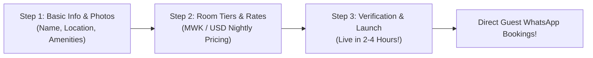
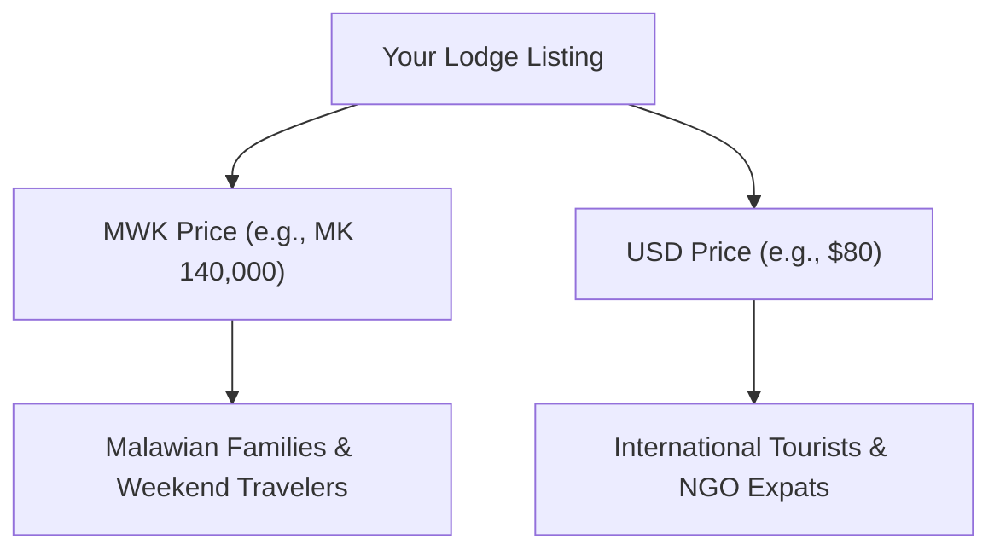

# Welcome to Travel Malawi — The Host Starter Pack
**Your Complete Guide to Listing, Getting Direct Bookings, and Keeping 100% of Your Revenue**

> [!NOTE]
> **Live Web Version Available**: You can also view and explore this interactive Host Starter Pack directly in the app at [travelmalawi.com/host-guide](http://localhost:3000/host-guide) or via the **"Host Starter Pack"** button on the homepage acquisition banner and footer!

---

## Moni! Welcome to the Travel Malawi Family

Whether you run a luxury safari camp in Liwonde, a family beach cottage in Cape Maclear, an eco-lodge in Nkhata Bay, a mountain cabin on Zomba Plateau, or a boutique guest house in Lilongwe or Blantyre—**this platform was built for you.**

For too long, Malawian accommodation owners have been forced to rely on foreign booking engines that charge 15% to 20% in commission fees, hold guest payments overseas for weeks, and block you from speaking directly with your own guests.

**Travel Malawi changes the game.** We connect domestic and international travelers directly to you—with **0% commission, direct mobile money settlement, and direct WhatsApp communication.**


---

## Why Having an Online Presence Is Essential for Malawian Lodges Today

For years, many lodges and beach cottages in Malawi relied solely on word-of-mouth or roadside boards. But traveler behavior has radically shifted:

1. **International Visitors Book Before They Fly**:
   Over **85%** of tourists, NGO delegations, embassy staff, researchers, and diaspora travelers research and reserve their accommodations online months before landing at Kamuzu or Chileka Airport. If your lodge is not online, you are completely invisible to high-paying international bookings.
2. **Domestic Weekend Trips Start on Smartphones**:
   Professionals and families in Lilongwe, Blantyre, and Mzuzu search for weekend breaks right from their mobile phones. Having an online profile puts your rooms, photos, and direct WhatsApp contact directly into their hands.
3. **Beating the 15%–20% Foreign Commission Trap**:
   Platforms like Booking.com take 15% to 20% in commissions and hold your money abroad. Travel Malawi provides a modern, high-converting online profile with **0% commission**, letting you settle payments instantly via Airtel Money, Mpamba, or Bank Transfer.
4. **Instant Credibility & Trust**:
   Travelers want to see exact Google Maps pins, verified backup solar power, borehole water, and clear photos before committing. An online presence removes all guest doubt.

> [!TIP]
> **You Don't Need an Expensive Website**: Custom websites cost MK 500,000+ to build and require ongoing hosting fees. Travel Malawi gives you a dedicated web profile, Google Maps listing, and direct WhatsApp guest inbox for free!

---

## The 4 Core Benefits for Lodge Owners

Listing your property on Travel Malawi is designed to give you total control, zero headaches, and maximum profit.


### 1. 0% Commission Guarantee
* Keep **100% of every Kwacha and Dollar** you charge.
* We never deduct booking cuts, service percentages, or surprise processing penalties.

### 2. Direct Payouts (No Escrow or Foreign Delays)
* Guests pay **directly to you**.
* Accept **Airtel Money, TNM Mpamba, National Bank / Standard Bank transfers**, or Visa/Mastercard swipe upon guest arrival.
* Your money never gets held in overseas bank accounts.

### 3. Direct WhatsApp Inquiries & Chat
* When a traveler wants to book, they connect **directly to your WhatsApp or phone line**.
* Answer questions in real-time, arrange boat transfers across the lake, accommodate dietary needs, and build personal guest relationships.

### 4. True Dual-Currency Freedom (MWK & USD)
* Display rates in **Malawian Kwacha (MWK)** for local travelers from Lilongwe and Blantyre.
* Simultaneously display rates in **US Dollars (USD)** for international tourists, NGO expats, and diaspora visitors.
* Update your rates in 10 seconds anytime exchange rates shift.

---

## How Easy It Is: Online Listing in 3 Simple Steps

You don’t need a computer or technical expertise. You can complete your listing from your smartphone in under 8 minutes!

````carousel

<!-- slide -->

````



### Step 1: Tell Us About Your Stay
* **Name & Town**: e.g., *"Lake Breeze Cottages, Cape Maclear"* or *"Highland Retreat, Zomba"*.
* **Category**: Choose from Lake & Beach, Safari & Wildlife, Mountain Escape, Romantic, Family, or City Hotel.
* **Photos**: Upload 5 to 10 photos directly from your phone’s camera roll.
* **Amenities**: Tap to select features you offer (Solar Backup Power, Wi-Fi, Swimming Pool, Lake Access, Boat Trips, Restaurant, Mosquito Nets).

### Step 2: Set Your Rooms & Nightly Rates
* Add your room types (e.g., *"Lakefront Chalet"*, *"Deluxe Family Room"*, *"Campsite"*).
* Enter your nightly rate in **MWK**, **USD**, or both!
* Specify how many guests each room accommodates.

### Step 3: Publish & Receive Bookings
* Hit **Submit Listing**.
* Our local operations team verifies your contact number and map pin (typically within 2 to 4 hours).
* Your stay is published on the homepage, and guest inquiries flow straight to your phone!

---

## Simple Smartphone Photography Tips

You don't need an expensive camera to attract high-paying guests. Modern smartphone cameras take breathtaking photos if you follow these 5 simple rules:


| Photography Rule | Do This ✅ | Avoid This ❌ |
| :--- | :--- | :--- |
| **1. Natural Sunlight** | Take photos between 8:00 AM – 10:00 AM or 3:30 PM – 5:00 PM when sunlight is warm and soft. | Never take photos at night using harsh camera flashes. |
| **2. Crisp, Tidy Beds** | Smooth out bedsheets, fluff pillows, and ensure mosquito nets hang neatly. | Avoid unmade beds, wrinkled covers, or clutter on bedside tables. |
| **3. Open the Curtains** | Open all curtains and veranda doors to show off your view (lake, garden, mountains). | Don't shoot against closed curtains that make rooms look small and dark. |
| **4. Clean Bathrooms** | Wipe down mirrors, ensure clean folded towels, and keep toilet lids down. | Avoid damp towels on floors, clutter, or open toiletries. |
| **5. Food & Hospitality** | Photograph your signature dishes (fresh Lake Chambo, tropical fruit platters, coffee on the deck). | Avoid half-eaten plates or dark kitchen shots. |

> [!TIP]
> **Landscape Photos Win**: Always turn your phone sideways (horizontal / landscape orientation) when photographing rooms and views. This fills the traveler's screen beautifully!

---

## Setting Your Rates for Maximum Bookings

Travelers in Malawi fall into two primary groups, and our platform lets you capture both seamlessly:

### Group A: Domestic Travelers (Lilongwe, Blantyre, Mzuzu)
* **Who they are**: Families, professionals, weekenders, wedding parties, conference attendees.
* **Preferred Currency**: **Malawi Kwacha (MWK)**.
* **Preferred Payment**: **Airtel Money, TNM Mpamba, or Bank Transfer**.
* **Tip**: Set realistic Kwacha rates rounded to clean numbers (e.g., MK 75,000, MK 120,000, MK 250,000).

### Group B: International Tourists, Expats & Safari Seekers
* **Who they are**: NGO workers, embassy staff, foreign backpackers, wildlife photographers, regional safari travelers.
* **Preferred Currency**: **US Dollars ($ USD)**.
* **Preferred Payment**: **Visa / Mastercard or Cash USD at check-in**.
* **Tip**: Quote transparent USD pricing (e.g., $45, $85, $150, $350+).



---

## WhatsApp Etiquette: Turning Inquiries into Confirmed Stays

Because guests connect with you directly via WhatsApp, how you reply determines your booking success:

### 1. Fast Replies Win Bookings
* Aim to reply within **15 minutes** of receiving a WhatsApp inquiry. Travelers often message 2 or 3 places when planning a weekend trip; the first friendly host to confirm availability almost always wins the reservation!

### 2. Ready-to-Use WhatsApp Reply Templates

#### When You Have Availability:
> *"Moni [Guest Name]! Thank you for reaching out to [Lodge Name]. Yes, our [Room Name] is available for your dates ([Check-in Date] to [Check-out Date]).*
> 
> *The rate is [MK Amount / USD Amount] per night, which includes [e.g., full breakfast, solar backup power, and lake access].*
> 
> *Would you like me to reserve these dates for you? We can secure your booking with a 50% deposit via Airtel Money, Mpamba, or Bank Transfer, with the balance payable upon arrival."*

#### Providing Arrival Directions:
> *"Looking forward to welcoming you! To reach us from the main road: Turn off at [Landmark / Junction], follow the signs for 1.5 km. The gate is on the right with a green sign. If you need 4x4 assistance or a boat pickup from [Location], please let us know in advance!"*

---

## Managing Your Calendar in Seconds

Double-bookings are the quickest way to disappoint travelers. Travel Malawi makes calendar management effortless:

* **1-Click Date Blocking**: Simply open your manager dashboard on your phone, tap your room calendar, and tap any dates you are fully booked or closed for maintenance.
* **Real-Time Accuracy**: Blocked dates immediately show as unavailable to travelers, preventing inquiries for dates you cannot accommodate.


---

## Frequently Asked Questions (FAQ)

**Q: Is listing really 100% free? Are there any hidden fees?**
> **A:** Yes! Listing your property and receiving direct guest bookings is **100% free with 0% commission**. We do not take a cut of your nightly room rate.

**Q: Can I manage my property using only a smartphone?**
> **A:** Absolutely. Our entire host portal and calendar management are fully optimized for mobile screens. You do not need a computer.

**Q: What if I am already listed on Airbnb or Booking.com?**
> **A:** That’s great! Many of our hosts are on other platforms too. Travel Malawi gives you an additional, dedicated channel to capture domestic Malawian travelers and regional tourists without losing 15% to 20% in commissions.

**Q: How do guests pay for their stays?**
> **A:** Guests pay you directly according to your lodge's preferred payment policy. Most hosts accept a 50% mobile money deposit (Airtel Money or TNM Mpamba) or bank transfer to confirm, with the remaining 50% settled in cash or card upon check-in.

**Q: Can our team help set up your listing?**
> **A:** Yes! If you are busy, you can send your photos, room rates, and property details directly to our local concierge team via WhatsApp, and we will create and format your profile for you at no cost!

---

## Your 10-Minute Launch Checklist

Ready to start welcoming more guests? Here is everything you need:

- [ ] **5 to 8 Landscape Photos** of your lodge, rooms, views, and dining on your phone.
- [ ] **Your WhatsApp Number** that you monitor regularly for booking inquiries.
- [ ] **Your Nightly Rates** in MWK and/or USD.
- [ ] **Property Location Notes** (directions, road turn-offs, boat transfer needs).
- [ ] **Click the Link to List**: Visit `travelmalawi.com/list-property` and tap **"Host a Property"**!

---

*Travel Malawi — Connecting the Warm Heart of Africa, One Stay at a Time.*
