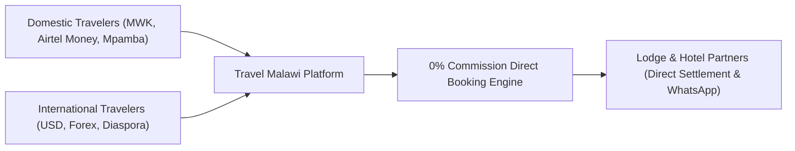
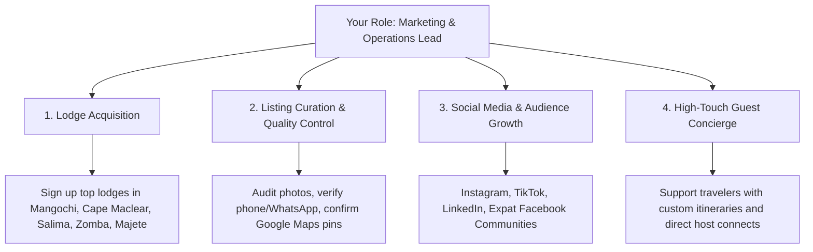

# Travel Malawi — Executive Platform & Strategy Deck
**Orientation & Growth Presentation for Marketing & Operations**

> [!NOTE]
> **Live Web Deck Available**: You can also review, present, or print this deck directly in your browser at [travelmalawi.com/marketing](http://localhost:3000/marketing) or via the **"Marketing Playbook"** link in the Admin Dashboard!

---

## Executive Summary: The Opportunity

Welcome to **Travel Malawi**. 

Malawi—the *Warm Heart of Africa*—possesses some of the continent's most pristine freshwater beaches, uncrowded wildlife reserves, and dramatic mountain plateaus. Yet, domestic and international travelers struggle with fragmented booking channels, outdated contact numbers, non-functional websites, and international booking engines that charge exorbitant fees while refusing local currency.

Travel Malawi was engineered from the ground up to solve this: **a modern, unified direct-booking hospitality ecosystem that bridges domestic kwacha-paying travelers and global safari seekers directly with verified Malawian lodge operators.**

---

## Slide 1: The Guest Experience & Visual Discovery

The guest journey begins with an immersive, high-speed web application designed to rival global leaders like Airbnb and Booking.com while highlighting authentic Malawian destinations.

### Key Platform Highlights:
- **Instant Destination Discovery**: Search by lake retreats, wildlife safaris, mountain lodges, or city hotels across Lilongwe, Blantyre, Cape Maclear, Likoma Island, and Nyika.
- **True Dual-Currency Engine**: Travelers can toggle effortlessly between **MWK (Malawian Kwacha)** and **USD ($)**. Local travelers see familiar, transparent Kwacha rates without surprise foreign exchange charges.
- **Zero-Friction Search**: Filter by check-in/check-out dates, guest count, and specific accommodation types.

---

## Slide 2: Curated Listings & The Host Acquisition Gateway

Properties are presented with rich visual storytelling, transparent pricing, and instant location context. For prospective lodge partners, our dedicated host acquisition banner welcomes them directly.

### Why Guests Love This:
- **Real-Time Dual Rates**: Clear Kwacha and Dollar rates side-by-side, catering to both local professionals looking for a weekend getaway and international tourists budgeting in dollars.
- **Zero Booking Fees for Guests**: Guests never pay convenience fees, card processing surcharges, or hidden markups.
- **Prominent Host CTA**: Domestic hoteliers and property owners see immediate prompts inviting them into the network with 0% commission.

---

## Slide 3: Editorial Lodge Showcase & Availability

When a traveler clicks into a lodge, they enter a dedicated editorial showcase featuring high-definition photo galleries, comprehensive amenity checklists, Google Maps precision pins, and dynamic room availability.

### Features That Drive Conversions:
- **Rich Media Carousels**: Showcasing infinity pools, private beach fronts, game drive vehicles, and dining experiences.
- **Verified Geographic Data**: Exact GPS coordinates and proximity notes ensuring travelers know road access conditions (e.g., 4x4 requirements).
- **Direct Concierge Access**: Floating WhatsApp and direct-call buttons allowing guests to ask questions about boat transfers, airstrip pickups, or dietary needs in real time.

---

## Slide 4: Room Tiers & The Interactive Booking Calendar

Travelers choose their room tier, review curated package add-ons, and verify live date availability before confirming their stay.

### Operational Strengths:
- **Customizable Inclusions**: Lodges can bundle Breakfast, All-Inclusive Dining, Lake Shuttles, or Guided Hikes directly into room tiers.
- **Live Visual Calendar**: Avoids double-booking by clearly highlighting available, reserved, and blocked dates.
- **StayOS Verification**: Gives travelers confidence that the property has been physically or digitally vetted by our operations team.

---

## Slide 5: The Lodge Acquisition Engine (Google Maps & 0% Commission)

Our secret weapon in onboarding hundreds of lodges across Malawi is our **0% Commission Direct-Booking Guarantee** coupled with instantaneous Google Maps onboarding.

### The Unbeatable Pitch to Lodge Managers:
| Feature | Booking.com / Agoda | Airbnb | Travel Malawi |
| :--- | :--- | :--- | :--- |
| **Commission Fee** | 15% – 25% per booking | 3% host + 14% guest | **0% Commission** |
| **Payout Currency** | Foreign bank transfer (forex delays) | USD / Payoneer | **Direct MWK or USD to Host** |
| **Settlement Method** | Withheld for 30–60 days | 24h after check-in | **Instant on Check-in (Airtel, Mpamba, Bank, Card)** |
| **Guest Contact** | Masked / Prohibited | Blocked until booked | **Direct WhatsApp & Phone Line** |
| **Setup Assistance** | Self-serve / Automated | Self-serve | **Dedicated Operations Concierge** |

---

## Slide 6: Frictionless Authentication & Role Segmentation

We redesigned our authentication modal into a clean, minimalist experience that separates travelers from hospitality hosts in one click.

### Highlights:
- **One-Click Google Sign-In**: Instant registration using verified Google OAuth credentials.
- **Native Email Authentication**: For managers who prefer corporate or private domain emails.
- **Admin Password Reset Engine**: As an operations lead, you can quickly reset host passwords directly if a lodge manager ever forgets their credentials.

---

## Slide 7: Your Operational Mandate as Marketing & Operations Lead

You are being brought on to run everything outside of coding. The technology stack is complete, responsive, lightning-fast, and battle-tested. 

### Immediate Deliverables:
1. **Curate the Top 50 Malawian Lodges**: Ensure all top-tier and mid-tier accommodations have complete, verified profiles.
2. **Launch Community Social Channels**: Produce high-engagement visual content showcasing hidden gems across Malawi.
3. **Establish Local Strategic Alliances**: Partner with vehicle rental companies (Land Cruiser rentals in Lilongwe/Blantyre), domestic flight operators (Ulendo Airlink), and corporate retreat planners.

> [!TIP]
> Refer to the accompanying **Operations Starter Pack** (`operations_starter_pack.md`) for your comprehensive day-to-day SOPs, outreach scripts, phone pitch guides, and first 90-day milestone roadmap!
