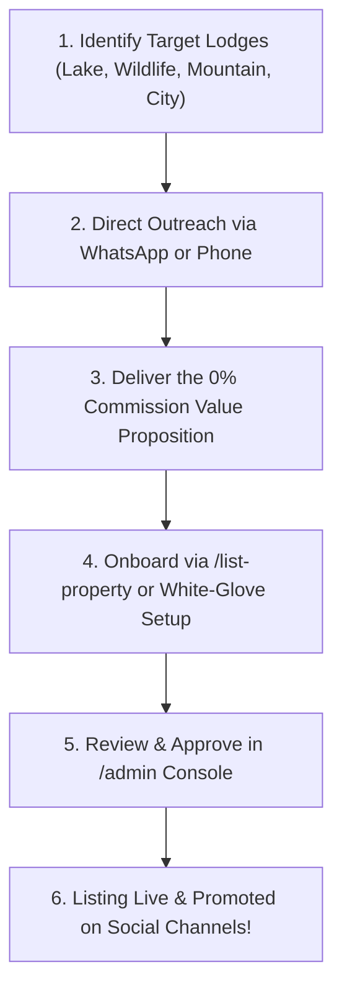
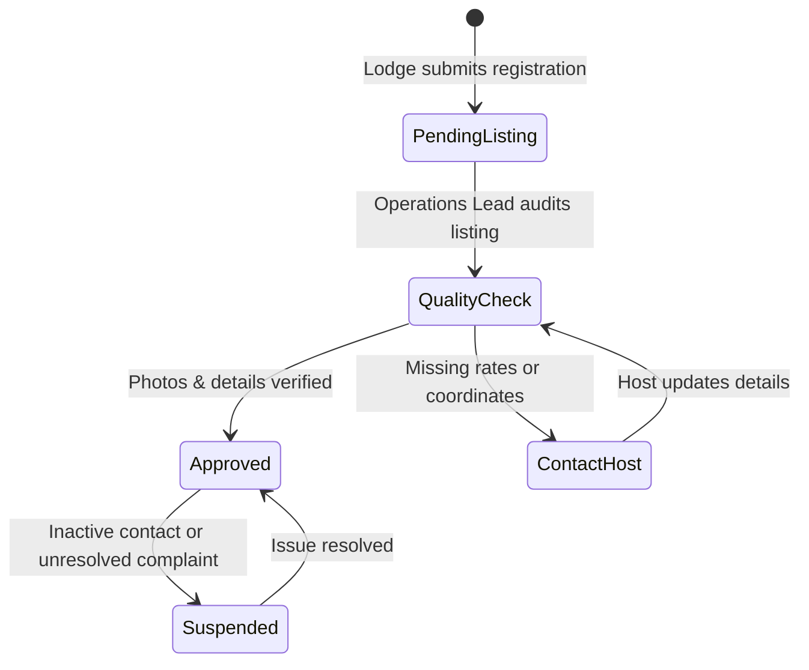
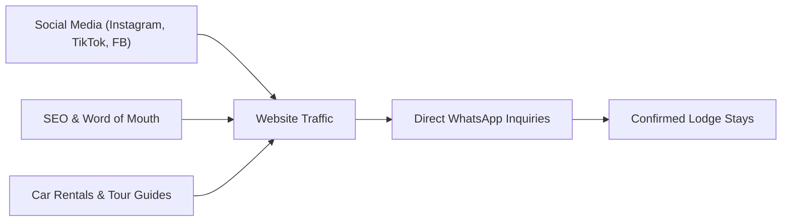
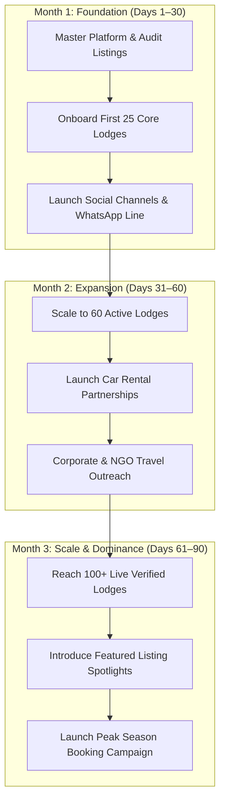

# Travel Malawi — Operations & Marketing Lead Starter Pack
**Complete Operational Manual & Day-One Playbook**
*For the Head of Operations, Host Acquisition & Growth*

> [!NOTE]
> **Interactive Web Playbook Available**: You can also review, present, or print the full visual playbook in your browser at [travelmalawi.com/marketing](http://localhost:3000/marketing) or via the **"Marketing Playbook"** button in the Admin Dashboard!
> Also inspect the companion **Host Starter Pack & Guide** at [travelmalawi.com/host-guide](http://localhost:3000/host-guide).

---

## 1. Welcome to the Team

Congratulations and welcome to **Travel Malawi**!

You are taking the helm of an ambitious, game-changing hospitality venture. Malawi's tourism industry has immense beauty—from the crystal waters of Cape Maclear and Likoma Island to the majestic peaks of Mount Mulanje and the wild safaris of Liwonde and Majete. However, the operational side of booking accommodation in Malawi has remained fragmented, frustrating, and expensive.

### Your Role as "The Operator"
The software is completely built, tested, fast, and stable. You do not need to write a single line of code. **Your mission is to run the business:**
1. **Lodge Acquisition**: Get the best lodges, cottages, campsites, and boutique hotels across Malawi listed on our platform.
2. **Platform Quality & Curation**: Ensure every listing has crisp photos, accurate rates (in MWK and USD), valid contact numbers, and precise Google Maps pins.
3. **Guest Experience & Concierge**: Ensure travelers find their dream stays and get rapid responses via WhatsApp.
4. **Brand & Marketing**: Turn Travel Malawi into the first name anyone thinks of when planning a stay in Malawi.

---

## 2. Why Online Presence is Life-or-Death for Malawian Lodges

When pitching lodges, your most persuasive angle is educating owners on how hospitality booking has fundamentally changed:

1. **85%+ of International Travelers Book in Advance Online**:
   - Tourists from the UK, US, South Africa, Germany, and the diaspora plan their itineraries months ahead.
   - If a lodge only exists as a phone number on a roadside signboard or a word-of-mouth referral, **it is completely invisible to these high-spending guests**.
2. **70%+ of Domestic Escapes Are Planned on Smartphones**:
   - Urban professionals and families in Lilongwe and Blantyre decide on Thursday or Friday where to spend their weekend.
   - They search on their phones, check photos, verify Kwacha rates, and message via WhatsApp. If they cannot quickly verify rates and room pictures, they book somewhere else.
3. **The OTAs Charge 15%–25% Extortionate Fees**:
   - Booking.com takes up to 25% and holds foreign currency offshore for 30–60 days.
   - On a \$2,000 one-week safari or lake cottage booking, the lodge gives away \$400 to a foreign intermediary. Travel Malawi costs **0%**, keeping that money in Malawi.
4. **Google Maps Visibility Drives Instant Trust**:
   - With our live Google Maps integration, lodges get accurately pinned with turn-by-turn directions, 4x4 road warnings, and proximity info.

---

## 3. Core Value Proposition: Why Lodges Choose Us

When you speak to a lodge owner, manager, or reservations agent, you have a massive competitive advantage over Booking.com, Airbnb, and Expedia. Memorize these points:

| Pain Point with Other Platforms | The Travel Malawi Advantage |
| :--- | :--- |
| **High Commission**: Booking.com charges 15%–20% on every stay. Airbnb charges up to 14%. | **0% Commission**: Travel Malawi takes **0% commission** on standard direct bookings. Hosts keep 100% of their nightly rate. |
| **Payment Delays & Escrow**: International sites hold funds overseas, creating complex forex payout issues. | **Direct Settlement**: Guests pay the lodge directly via **Airtel Money, TNM Mpamba, National Bank/Standard Bank transfer, or Card/Cash** upon arrival. |
| **Blocked Guest Communication**: Traditional OTAs mask guest phone numbers and prohibit WhatsApp. | **Direct WhatsApp Contact**: Guests can message the lodge's reservations team directly to arrange boat transfers, meal plans, or special requests. |
| **Currency Inflexibility**: Other platforms struggle with Malawian Kwacha (MWK) fluctuations. | **Dual-Currency Support**: Lodges can publish rates in **MWK for domestic travelers** and **USD for international tourists/expats** at the exact same time. |

---

## 4. Lodge Acquisition & Onboarding Playbook

Your primary operational metric in Month 1 is **Number of Verified Live Lodges**.



### 4.1 Geographic Target List

Divide your acquisition efforts across four strategic zones:

#### Zone A: The Southern Lakeshore & Islands (High Weekend Demand)
- **Locations**: Cape Maclear, Monkey Bay, Mangochi (Club Makokola strip), Likoma Island, Chizumulu Island.
- **Key Properties to Target**: Kaya Mawa, Pumulani, Gecko Lounge, Cape Maclear EcoLodge, The Warm Heart Adventure Lodge, Zabov Cottages, Nanchengwa.
- **Audience**: Lilongwe/Blantyre weekenders, expats, watersport enthusiasts.

#### Zone B: Wildlife & Safari Reserves
- **Locations**: Liwonde National Park, Majete Wildlife Reserve, Nkhotakota Wildlife Reserve, Vwaza Marsh, Kasungu.
- **Key Properties to Target**: Mvuu Lodge/Camp, Thawale Camp, Mkulumadzi, Tongole Wilderness Lodge, Bua River Lodge.
- **Audience**: International safari tourists, NGO holiday retreats, nature lovers.

#### Zone C: Mountain & Highland Escapes
- **Locations**: Zomba Plateau, Mount Mulanje, Nyika Plateau, Viphya Highlands (Luwawa).
- **Key Properties to Target**: Sunbird Ku Chawe, Zomba Forest Lodge, Kara O Mula, Luwawa Forest Lodge, Chelinda Lodge & Camp.
- **Audience**: Hikers, trail runners, cool-weather weekenders.

#### Zone D: Urban & Business Hubs
- **Locations**: Lilongwe (Area 10, Area 43, City Centre) & Blantyre (Sunnyside, Namiwawa).
- **Key Properties to Target**: Latitude 13°, Woodlands Lilongwe, Sunbird Mount Soche, Sunbird Capital, Leslie Lodge, boutique Airbnbs.
- **Audience**: Business travelers, consultants, government delegates, domestic tourists.

---

### 4.2 Outreach Scripts (Copy & Paste)

#### Script A: WhatsApp to Lodge Owner / Reservations Manager
> *"Hello [Name / General Manager], I hope you're having a great week!*
> 
> *My name is [Your Name], Head of Operations at **Travel Malawi** (travelmalawi.com). We've launched Malawi's dedicated direct-booking platform designed to promote premier Malawian accommodations directly to domestic and international travelers.*
> 
> *Unlike international booking engines that charge you 15–20% commission and delay foreign payouts, Travel Malawi is **completely 0% commission**. Guests book and pay you directly via your own Airtel Money, Mpamba, bank transfer, or card at check-in, and we connect inquiries straight to your WhatsApp.*
> 
> *We would love to feature [Lodge Name] on our platform at no cost. Would you prefer me to send you the 5-minute listing link, or can I set up your profile for you if you share your high-res photos and current rates?*
> 
> *Looking forward to welcoming more guests to [Lodge Name]!*
> *Best regards,*
> *[Your Name] | Travel Malawi Operations"*

#### Script B: 3-Minute Phone Call Pitch
> **You**: *"Good morning! May I please speak with the lodge manager or reservations team regarding new guest bookings?"*
> **Lodge**: *"Speaking / transferring you."*
> **You**: *"Hi [Name], my name is [Your Name] with Travel Malawi. We are building the central online home for tourism in Malawi, helping local travelers from Lilongwe and Blantyre as well as international tourists discover and book stays.*
> *I’m calling because we want to feature [Lodge Name] on our platform. The big difference with us is we charge **0% commission**—you keep 100% of your booking rate, guests pay you directly into your local account or mobile money, and guest messages come straight to your reservations WhatsApp.*
> *Can I send a quick overview and onboarding link to your WhatsApp number?"*

---

### 4.3 The Two Onboarding Paths

1. **Self-Service (Lodge Does It)**:
   - Direct the manager to `http://localhost:3000/list-property` (or production URL).
   - They click **"Host a Property"** on the registration modal.
   - They fill out basic property info, upload photos, set room types, specify MWK and USD rates, and submit.
2. **White-Glove Concierge (You Do It For Them — Highly Recommended for Top Lodges)**:
   - For high-end luxury lodges (e.g., Robin Pope Safaris, Kaya Mawa, Sunbird), managers are busy. 
   - Ask them to send their digital brochure, rate sheet, and Google Drive / Dropbox link of high-res photos.
   - You register their account or create the listing, upload 5–10 stunning photos, input their room tiers with dual pricing, and send them the completed live link to review.

---

### 4.4 Listing Quality Checklist (The "Gold Standard")
Before approving any listing, ensure it meets these 5 criteria:
- [ ] **Photos**: Minimum 5 high-resolution photos (Cover photo must show either the view, pool, lakefront, or main lodge). No blurry phone photos taken in the dark!
- [ ] **Dual Pricing**: Set an accurate **MWK price** (e.g., MK 180,000) and **USD price** (e.g., $100).
- [ ] **Direct Contact**: Accurate phone number and WhatsApp number with international dialing code (`+265...`).
- [ ] **Location & Google Maps**: Verify that the map pin actually sits on the lodge and not in the middle of Lake Malawi or a random forest.
- [ ] **Clear Amenities**: Tag Wi-Fi, Swimming Pool, Air Conditioning, Restaurant, Lake Access, 4x4 Required, etc.

---

## 5. Admin Dashboard Operations Manual

As the operations lead, you have access to the platform's central administration portal at:
```
http://localhost:3000/admin (or your live domain /admin)
```



### 5.1 Daily Admin Responsibilities
1. **Log in with your Administrator account**.
2. **Review Pending Properties**:
   - Every newly submitted property appears with a `Pending` status badge.
   - Click the listing to review all details.
   - Send a quick test WhatsApp message to the contact number: *"Hi [Lodge Name], this is Travel Malawi verifying your contact details before publishing your listing on our homepage."*
   - Once verified, click **"Approve"**. The property will immediately appear on the homepage and in search results.
3. **Managing Host Accounts & Password Resets**:
   - If a lodge manager forgets their login password or cannot access their dashboard, navigate to the **Users** tab in `/admin`.
   - You can trigger an administrative password reset email or update their credentials.

---

## 6. Guest Concierge & Inquiry Handling SOP

Travel Malawi provides high-touch hospitality. When guests have questions, they often reach out to our platform's direct concierge line before booking.

### Handling Booking Inquiries:
1. **Response Time Target**: Respond to every WhatsApp inquiry within **15 minutes** during business hours (7:30 AM – 7:30 PM).
2. **Qualify the Guest's Needs**:
   - Dates of stay (Check-in & Check-out).
   - Number of adults and children.
   - Budget preference (Backpacker / Eco-lodge, Mid-range comfortable, or Luxury boutique).
   - Transportation status (Do they have their own vehicle, need a 4x4, or need boat/flight transfer?).
3. **Connecting Guest to Host**:
   - Introduce the guest to the lodge manager via a 3-way WhatsApp group or forward the guest’s contact directly to the lodge reservations desk.
   - Example: *"Hi [Lodge Manager], we have Mr. Banda looking to book a 2-night stay for a family of 4 from Oct 12 to 14. I have cc'd him here to confirm villa availability and payment details."*

---

## 7. Marketing Engine & Growth Strategy

You are responsible for driving both **demand (travelers booking stays)** and **supply (lodges joining)**.



### 7.1 Social Media Blueprint

#### A. Instagram & TikTok (@TravelMalawi)
- **Content Pillar 1: Visual Escapes (Reels/TikToks)**
  - Short 7–15 second clips with trending African / chill acoustic sounds.
  - Examples: Sunrise over Likoma Island; jumping into crystal-clear Cape Maclear waters; watching elephants from the Mvuu pool deck; sunset cocktails on the Zomba plateau.
- **Content Pillar 2: "Where to Stay Under MK 100,000 vs Luxury"**
  - Carousel posts comparing accessible weekend escapes with ultra-luxury bucket-list lodges.
- **Content Pillar 3: Practical Travel Tips**
  - "How to get to Likoma Island in 2026 (Ilala ferry vs Ulendo flight)"
  - "Top 5 romantic anniversary getaways in Southern Malawi"
  - "Best dog-friendly cottages in Salima"

#### B. Facebook Community Engagement
- Join and actively participate in:
  - *Expats in Malawi (Lilongwe & Blantyre)*
  - *What's Happening in Lilongwe*
  - *Malawi Tourism & Travel Community*
- Post curated guides: *"Planning a weekend trip to Cape Maclear? Here is our curated list of 6 lakefront lodges with direct contact numbers and 0% booking fees."*

#### C. LinkedIn (Corporate & NGO Travel)
- Target HR Directors, Country Directors, and Operations Managers at UN agencies, USAID contractors, GIZ, and commercial banks.
- Pitch Travel Malawi as the single portal to find vetted conference facilities, retreat lodges, and team-building retreats.

---

### 7.2 Strategic Partnerships
Develop mutually beneficial referral loops with key local tourism stakeholders:
1. **4x4 Car Rental Agencies**: Partner with Land Cruiser / Hilux rental companies in Lilongwe and Blantyre. Provide them with Travel Malawi discount cards or itinerary booklets.
2. **Local Tour Guides & Boat Captains**: In Cape Maclear, Nkhata Bay, and Mulanje, connect trusted guides to our guests.
3. **Aviation Charters**: Coordinate with Ulendo Airlink and Nyassa Air Taxi for packages to Likoma and Nyika.

---

## 8. Weekly Operating Rhythm

To maintain momentum, structure your week as follows:

| Day | Focus Area | Key Tasks |
| :--- | :--- | :--- |
| **Monday** | Platform Audit & Weekly Goals | Review weekend inquiries; check `/admin` for pending listings; audit rates; set weekly lodge acquisition targets. |
| **Tuesday** | Cold Outreach & Calls | Call 10 new lodges across target zones; follow up on pending onboarding links. |
| **Wednesday** | Content & Social Media | Create and schedule 3 high-impact reels/posts; publish weekend itinerary guide on Facebook/Instagram. |
| **Thursday** | Partner Visits & Relationship Building | Meet with Lilongwe/Blantyre hotel managers, tour operators, or car rental partners. |
| **Friday** | Weekend Travelers Push | Broadcast weekend availability alerts on WhatsApp status & Instagram stories; support last-minute bookings. |
| **Saturday / Sunday** | Concierge Monitoring | Light monitoring of WhatsApp concierge line for travelers on the road (road conditions, check-in questions). |

---

## 9. First 30–60–90 Days Roadmap & KPIs



### Milestone Breakdown & Deliverables

| Phase | Timeline | Primary Focus | Key Deliverables & Targets |
| :--- | :--- | :--- | :--- |
| **Month 1: Foundation** | Days 1–30 | Anchor Acquisition & Setup | • Onboard 25 core lodges across Cape Maclear, Mangochi, Lilongwe, and Blantyre.<br>• Audit high-resolution photos & verify Google Maps pins.<br>• Launch official social channels (Instagram, TikTok, Facebook).<br>• **Target**: 25 verified live listings, 50+ inquiries, 1,000+ followers. |
| **Month 2: Expansion** | Days 31–60 | Geographic Reach & Alliances | • Expand to 60 properties (Liwonde, Majete, Zomba, Nyika, Likoma Island).<br>• Launch 4x4 car rental partnerships in Lilongwe & Blantyre.<br>• Initiate corporate & NGO retreat travel outreach.<br>• **Target**: 60 verified live listings, 3 corporate retreat bookings. |
| **Month 3: Scale & Dominance** | Days 61–90 | Market Dominance & Monetization | • Scale to 100+ active properties across all regions of Malawi.<br>• Partner with Ulendo Airlink and regional tour operators.<br>• Launch peak holiday season campaigns & featured listing spotlights.<br>• **Target**: 100+ verified live listings, default direct-booking portal. |

### Key Performance Indicators (KPIs):
- **Month 1 Target**: 
  - **25 verified live listings** across Lake Malawi, Lilongwe, Blantyre, and Zomba.
  - **50+ direct guest inquiries** facilitated.
  - **1,000+ active followers** across Instagram & Facebook.
- **Month 2 Target**: 
  - **60 verified live listings** (expanding to Nyika, Majete, Likoma Island).
  - First 3 corporate retreat bookings booked through our concierge.
- **Month 3 Target**: 
  - **100+ verified live listings**.
  - Established as the default direct-booking portal for domestic and regional travelers in Malawi.

---

## 10. Frequently Asked Questions (FAQ)

**Q: A lodge manager asks: "Why is it 0% commission? How do you make money?"**
> **A:** *"We are building Malawi's primary hospitality ecosystem. Our core directory and direct bookings will always remain commission-free for standard listings so local businesses keep 100% of their revenue. Down the road, we will offer optional premium marketing services, such as featured homepage placement, professional drone photography, and sponsored newsletter spots."*

**Q: A lodge asks: "Do we have to manually update calendars?"**
> **A:** *"Our platform features an intuitive visual calendar where you can block dates in 2 seconds. Furthermore, because guests connect with you directly via WhatsApp before arriving, you maintain full control over your reservations."*

**Q: What if a lodge changes their rates due to Kwacha fluctuations?**
> **A:** *"The lodge manager can log into their dashboard anytime from their phone to adjust their MWK and USD rates. Alternatively, you as the operations lead can update it for them upon request."*

---

## 11. Emergency Contacts & Escalation

- **Product & Engineering Escalation**: Contact the Lead Engineer for platform outages, bug reports, or database errors.
- **Executive & Commercial Decisions**: Contact the Founder for strategic brand partnerships, media appearances, or major commercial contracts.

*Welcome aboard. Let's showcase the Warm Heart of Africa to the world!*
